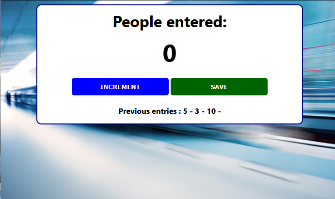

## 1 - Build a Passenger Counter App 

### Summary

Building a Passenger counter app that  that allows you to count passengers entering the metro.
Using a button we can increase the counter (INCREMENT) and using another we can save the data and reset the counter (SAVE).


Its a basic project that allows you to understand the various components of a website, how javascript interacts with the html document and what the basics of the language are

### Code and notes 💡

HTML : define the content of web pages 

CSS : define the layout of the web pages

JAVASCRIPT : program behaviour of the web pages 

</aside>

```html
</div>
<script src="my_script.js"></script>
```

```html
<h2 id="count-el">0</h2>
<button id="increment-btn" onclick="increment()">INCREMENT</button>
<button id="save-btn" onclick="save()">SAVE</button>
```

script tag could be placed at the end of the HTML file or inside the HEAD and BODY sections. 

tag **id=””** is used to interact with document, same for **onclick = function()**

it is used to call a function present in the script.js 


```jsx
// camelCase for javascript variables 
let countEl = document.getElementById("count-el")
                                // pass arguments - giving the function dome data to work with 
```
**getElementById()** "finds" an HTML element (with id="count-el") and can manipulate it 

### JavaScript Display Possibilities

JavaScript can "display" data in different ways:

- Writing into an HTML element, using `innerHTML` or `innerText`.
- Writing into the HTML output using `document.write()`.
- Writing into an alert box, using `window.alert()`.
- Writing into the browser console, using `console.log()`.

> Use innerHTML when you want to change an HTML element.
> 
> 
> Use innerText when you only want to change the plain tex
> 

For debugging purposes, you can call the `console.log()` method in the browser to display data.

```jsx
let count = 0

// Debugging purpose, to print inside browser console 
console.log(count) 
```
---
### Keywords

| Keyword | Description |
| --- | --- |
| var | Declares a variable |
| let | Declares a block variable |
| const | Declares a block constant |
| if | Marks a block of statements to be executed on a condition |
| switch | Marks a block of statements to be executed in different cases |
| for | Marks a block of statements to be executed in a loop |
| function | Declares a function |
| return | Exits a function |
| try | Implements error handling to a block of statements |
---
