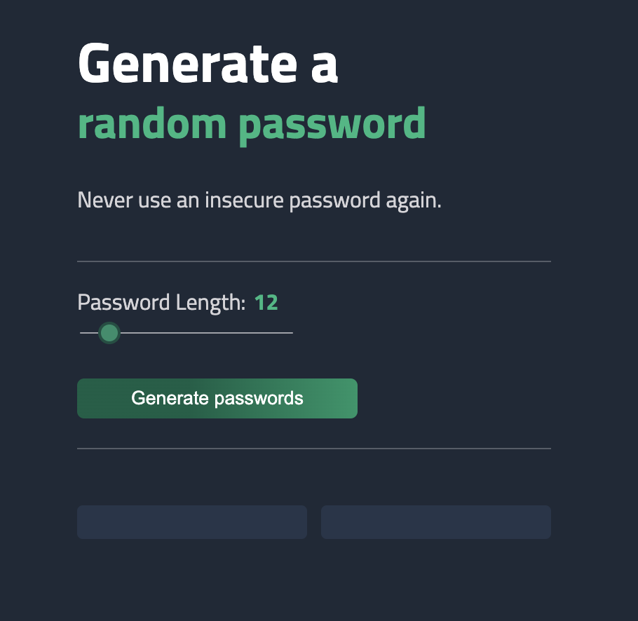
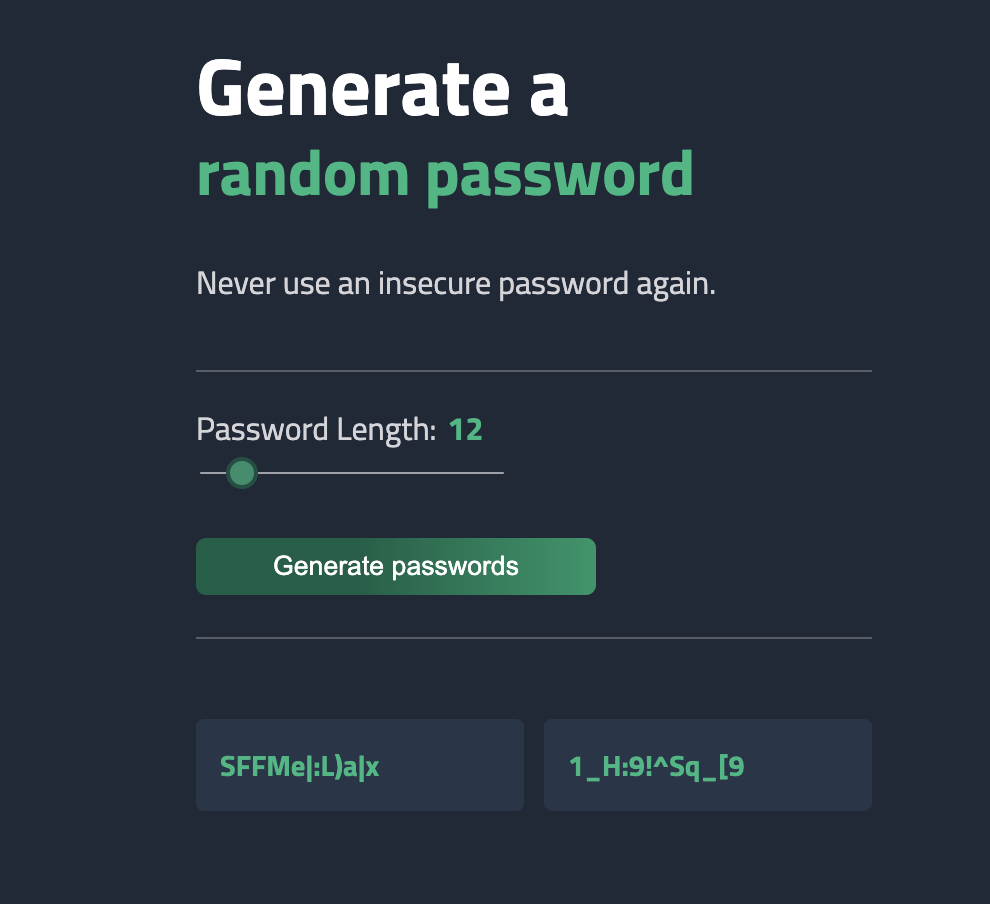

### Challenge

Users should be able to:

- Generate 2 passwords by 8-50 characters clicking on the button
- Set the password length by slider
- See passwords length in real time
- Copy passwords to the clipboard clicking on the them
- See hover states for interactive elements

### **Technologies Used**

- **HTML5** – For page structure and semantic markup
- **CSS3** – Custom styling using variables, flex/grid layout, and transitions
- **JavaScript (Vanilla)** – For generating passwords, updating the UI, and interactivity
- **Google Fonts** – *Titillium Web* font for a clean UI

---

## Project Features

### 1. Random Password Generator

- Generates two random passwords at a time
- Uses a full set of alphanumeric and special characters
- Password length is customizable via a range slider

```jsx
const characters = ["A", "B", ..., "/", "?"]; // Full array of usable characters

function generatePassword() {
    let psw_tmp = "";
    let pswLength = slider.value;

    for (let i = 0; i < pswLength; i++) {
        let index = Math.floor(Math.random() * characters.length);
        psw_tmp += characters[index];
    }

    return psw_tmp;
}
```

---

### 2. Dynamic Slider for Password Length

- Updates the password length in real-time as the user moves the slider
- Displays current length next to the label

```jsx
let slider = document.querySelector("#psw-length");
let lengthTxt = document.querySelector("#length-txt");

slider.oninput = function() {
    lengthTxt.innerHTML = this.value;
};
```

---

### 3. Copy Password to Clipboard

- Clicking a password box copies it to clipboard
- Shows a popup notification to the user
- Also alerts if the box is empty (no password generated yet)

```jsx
function copyToClipboard(id) {
    const text = document.getElementById(id).textContent.trim();

    if (text === "") {
        showPopUp("No password to copy");
        return;
    }

    navigator.clipboard.writeText(text).then(() => {
        showPopUp("Password copied to clipboard");
    }).catch(() => {
        showPopUp("Failed to copy");
    });
}
```

---

### 4. Animated Popup Feedback

A custom popup at the bottom of the screen appears temporarily to confirm copy actions or show errors.

```jsx
function showPopUp(message) {
    const popup = document.getElementById('copy-popup');
    popup.textContent = message;
    popup.classList.add('show');

    setTimeout(() => {
        popup.classList.remove('show');
    }, 1000);
}
```

```css
.copy-popup {
    position: fixed;
    bottom: 30px;
    left: 50%;
    transform: translateX(-50%);
    background-color: var(--accent-green);
    color: var(--white);
    padding: 10px 20px;
    border-radius: 8px;
    font-size: 1rem;
    opacity: 0;
    pointer-events: none;
    transition: opacity 0.3s ease, transform 0.3s ease;
}

.copy-popup.show {
    opacity: 1;
    transform: translateX(-50%) translateY(-10px);
}
```

---

## Design Choices

- **Dark mode UI** using CSS variables (`-bg-color`, `-accent-green`, etc.)
- **Grid and Flexbox layout** for responsiveness and clean structure
- Subtle animations and hover effects to enhance user interaction





---

## Key Learnings

- How to manipulate the DOM using `querySelector`, `.textContent`, etc.
- Event-driven programming with `onclick` and `oninput`
- Creating feedback loops in UI using popups and class toggling
- Clipboard API usage (`navigator.clipboard.writeText()`)
- Organizing and modularizing JavaScript functions