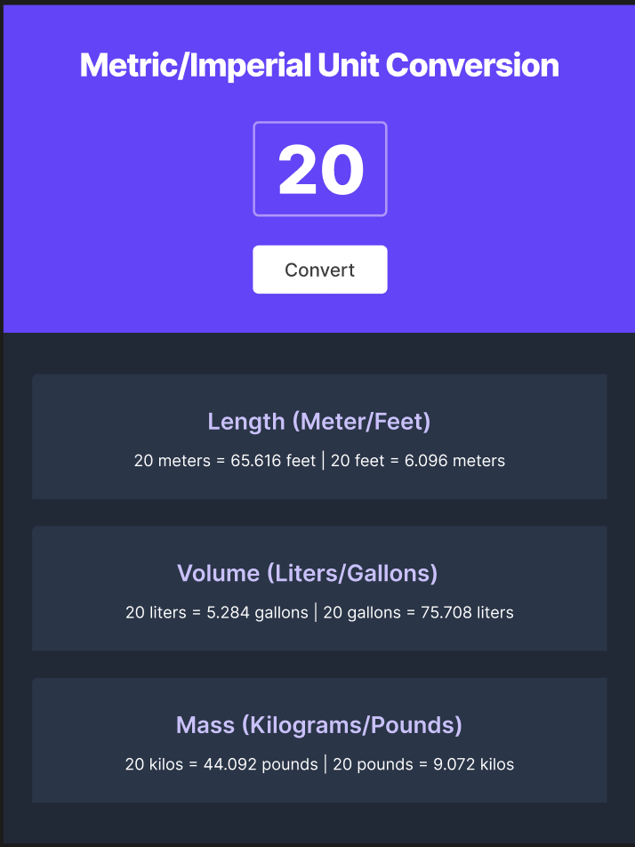
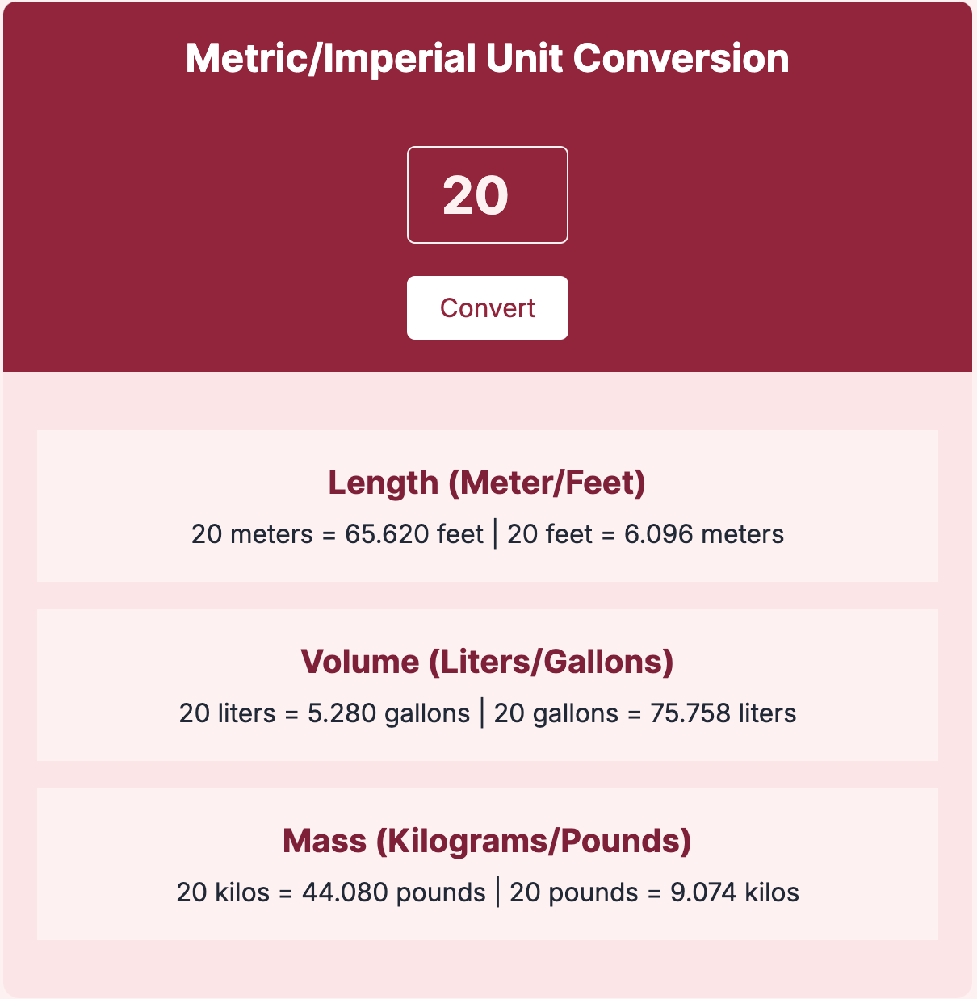

# 📏 Metric/Imperial Unit Converter

A simple and clean unit conversion tool built with **HTML**, **CSS**, and **JavaScript**.

This project converts values between **meters/feet**, **liters/gallons**, and **kilograms/pounds**.

---

## ✨ Features

- 📥 Input a number and instantly convert between metric and imperial units.
- 🎨 Minimal, modern, and responsive design.
- 🔥 Easy to extend with more units or features.
- 🌐 Mobile-friendly layout (max-width: 600px).

---

## 📂 Technologies Used

- HTML5
- CSS3 (Flexbox, Variables, Google Fonts)
- Vanilla JavaScript (DOM Manipulation, Event Handling)

---

## 🚀 How It Works

1. User enters a number in the input field.
2. Clicking the **Convert** button triggers the calculations.
3. Results are displayed in cards for:
    - **Length**: meters ⇄ feet
    - **Volume**: liters ⇄ gallons
    - **Mass**: kilograms ⇄ pounds

---

## 📸 Screenshot

From Scrimba 



My Design 



---

## 📚 Lessons Learned

- Separation of concerns: keeping HTML, CSS, and JavaScript organized.
- Using functions (`convertAll()`) for cleaner, modular code.
- DOM manipulation (`getElementById`, `.textContent`).
- Flexbox and CSS Variables for clean layouts and easier theming.
- Floating-point precision using `.toFixed(3)`.
- Event handling and dynamic content updates.

> Created a single function where all the conversions are made, and return an object
> 

```jsx
function convertAll(number) {
    
    // Length
    let length = `${number} meters = ${(number * meter).toFixed(3)} feet | ${number} feet = ${(number / meter).toFixed(3)} meters`

    // Volume
    let volume = `${number} liters = ${(number * liter).toFixed(3)} gallons | ${number} gallons = ${(number / liter).toFixed(3)} liters`

    // Mass
    let mass = `${number} kilos = ${(number * kilogram).toFixed(3)} pounds | ${number} pounds = ${(number / kilogram).toFixed(3)} kilos`

    // Return all of them together inside an object 
    return {
        length: length,
        volume: volume,
        mass: mass
    }
}
```

> Save the return of the function inside a variable and call the single element to display inside the <p> of the html
> 

```jsx
convertBtn.addEventListener("click", function () {
    
    // Get value from inputEl and convert to number 
    let value = Number(inputEl.value)

    let convertedValues = convertAll(value)

    // Display the values inside the <p> element in html 
    lengthEl.textContent = convertedValues.length

    volumeEl.textContent = convertedValues.volume

    massEl.textContent = convertedValues.mass
})
```